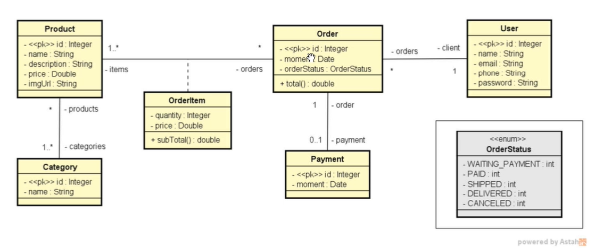
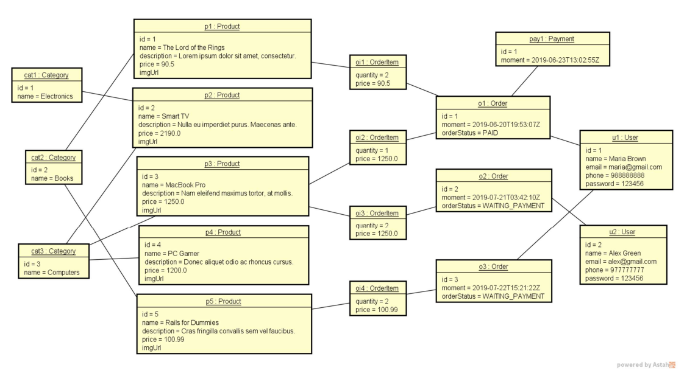
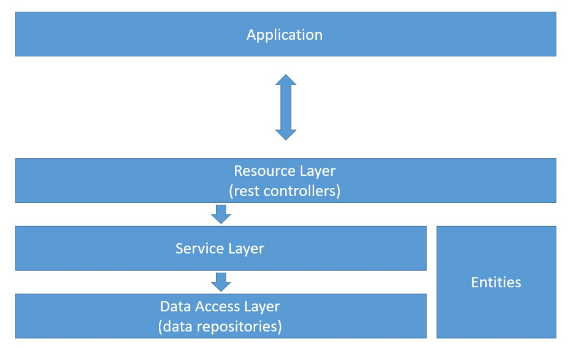

# Domain Model



<hr>

# Domain Instance



<hr>

# Logical Layers



<hr>

## User entity and resource
### Basic entity checklist:
* Basic attributes
* Associations (instantiate collections)
* Constructors
* Getters & Setters (collections: only get)
* hashCode & equals
* Serializable

<hr>

## H2 database, test profile, JPA repository
### Checklist:
* JPA & H2 dependencies
* application.properties
* application-test.properties
* Entity/; JPA mapping
* Repository

#### Dependencies:

```
<dependency>
    <groupId>org.springframework.boot</groupId>
    <artifactId>spring-boot-starter-data-jpa</artifactId>
</dependency>

<dependency>
    <groupId>com.h2database</groupId>
    <artifactId>h2</artifactId>
    <scope>runtime</scope>
</dependency>
```

#### application.properties:
A propriedade 'spring.jpa.open-in-view' é uma configuração do Spring Boot que, quando definida como 'true', mantém a sessão do Hibernate aberta até que a visualização seja renderizada. Isso permite o carregamento
preguiçoso de entidades JPA, o que pode ser útil para evitar consultas desnecessárias ao banco de dados.
<br>

No entanto, deve-se ter cuidado ao usar essa configuração, pois manter a sessão aberta por muito tempo pode
levar a problemas de desempenho.

```
spring.profiles.active=test

# Permite trazer dados associaddos
spring.jpa.open-in-view=true
```

#### application-test.properties:
````
# DATASOURCE
spring.datasource.driverClassName=org.h2.Driver
spring.datasource.url=jdbc:h2:mem:testdb
spring.datasource.username=sa
spring.datasource.password=

# H2 CLIENT
spring.h2.console.enabled=true
spring.h2.console.path=/h2-console

# JPA, SQL
spring.jpa.database-platform=org.hibernate.dialect.H2Dialect
spring.jpa.defer-datasource-initialization=true
spring.jpa.show-sql=true
spring.jpa.properties.hibernate.format_sql=true
````
<hr>

## JPA repository, dependency injection, database seeding
### Checklist:
* UserRepository extends JPARepository<User, Long>
* Configuration class for "test" profile
* `@RequiredArgsConstructor` UserRepository
* Instantiate objects in memory
* Persist objects

#### Objects:
```
User user1 = new User(
  null,
  "Maria Brown",
  "maria@gmail.com",
  "98888888888",
  "123456"  
);

User user2 = new User(
  null,
  "Alex Green",
  "alex@gmail.com",
  "97777777777",
  "123456"  
);
```
<hr>

## Service layer, component registration
#### Components registration:
```
@Component
@Service
@Repository
```
<hr>

## Order, Instant, ISO 8601
### Basic new entity checklist:
* Entity
  * "To many" association, lazy loading, JsonIgnore
* Repository
* Seed
* Service
* Resource

#### Objects:
```
Order order1 = new Order(
    null,
    Instant.parse("2024-02-16T01:03:07Z"),
    user1
);

Order order2 = new Order(
    null,
    Instant.parse("2024-02-17T01:03:07Z"),
    user2
);

Order order3 = new Order(
    null,
    Instant.parse("2024-02-18T01:03:07Z"),
    user1
);
```

<hr>

## OrderStatus enum

## Category
```
Objects: 
Category cat1 = new Category(null, "Electronics"); 
Category cat2 = new Category(null, "Books"); 
Category cat3 = new Category(null, "Computers");
```

## Product

```
Objects:
Product p1 = new Product(null, "The Lord of the Rings", "Lorem ipsum dolor sit amet, consectetur.", 90.5, "");
Product p2 = new Product(null, "Smart TV", "Nulla eu imperdiet purus. Maecenas ante.", 2190.0, "");
Product p3 = new Product(null, "Macbook Pro", "Nam eleifend maximus tortor, at mollis.", 1250.0, "");
Product p4 = new Product(null, "PC Gamer", "Donec aliquet odio ac rhoncus cursus.", 1200.0, "");
Product p5 = new Product(null, "Rails for Dummies", "Cras fringilla convallis sem vel faucibus.", 100.99, "");
```

Provisório:
```
# Category class:

@Transient
private Set<Product> products = new HashSet<>();

public Category(Long id, String name) {
    this.id = id;
    this.name = name;
}

```

```
# Product class:

@Transient
private Set<Category> categories = new HashSet<>();

public Product(Long id, String name, String description, Double price, String imgURL) {
    this.id = id;
    this.name = name;
    this.description = description;
    this.price = price;
    this.imgURL = imgURL;
}
```
<hr>

## Many-to-many association with JoinTable

```
# Category class:

@JsonIgnore
@ManyToMany(mappedBy = "categories")
private Set<Product> products = new HashSet<>();

# Product class:

@ManyToMany
@JoinTable(
    name = "product_category",
    joinColumns = @JoinColumn(name = "product_id"),
    inverseJoinColumns = @JoinColumn(name = "category_id")
)
private Set<Category> categories = new HashSet<>();

# TestConfig.run():

p1.getCategories().add(cat2);
p2.getCategories().add(cat1);
p2.getCategories().add(cat3);
p3.getCategories().add(cat3);
p4.getCategories().add(cat3);
p5.getCategories().add(cat2);

productRepository.saveAll(Arrays.asList(p1, p2, p3, p4, p5));
```

<hr>

## OrderItem, many-to-many association with extra attributes
### Checklist:
* OrderItemPK
* OrderItem
* Order one-to-many association
* Seed

````
Objects:
OrderItem oi1 = new OrderItem(o1, p1, 2, p1.getPrice());
OrderItem oi2 = new OrderItem(o1, p3, 1, p3.getPrice());
OrderItem oi3 = new OrderItem(o2, p3, 2, p3.getPrice());
OrderItem oi4 = new OrderItem(o3, p5, 2, p5.getPrice());
````

### Part 2:

Corrigir erro na comunicação bidirecional:

```
# OrderItemPk class:

@ManyToOne
@JoinColumn(name = "order_id")
@JsonIgnore
private Order order;

# OrderItem class:

@JsonIgnore
public Order getOrder(){
    return id.getOrder();
}
```
